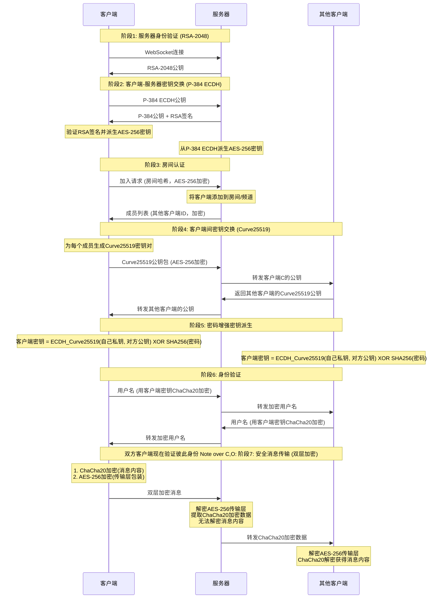

# ProriseChat

> 真正零知识的端到端加密聊天室，Cloudflare Workers 上的轻量即时通信解决方案。

## ✨ 核心特性

- 🔒 端到端零知识：所有加解密在浏览器完成，服务器仅盲转发密文。
- ⚡ 即开即用：Cloudflare Workers 一键部署，静态资源自动托管。
- 🛰️ 持久连接：Durable Objects 管理房间与成员状态，支持多成员实时同步。
- 🧩 无状态存储：不写数据库，不落盘，消息仅存内存，前向安全。
- 🎨 纯前端体验：原生 ES Modules + Vite 构建，支持主题、表情、文件与图片发送。


## 🎬 Demo


## 🚀 快速开始

```bash
clone该项目
pnpm install
pnpm run dev
```

打开浏览器，即可进入本地开发房间体验。

## 📦 安装与部署

### 前置要求
- Node.js >= 18
- pnpm >= 8（或 npm/yarn 等价命令）
- Cloudflare 账号与 `wrangler` 已登录（`pnpm dlx wrangler login`）

### Cloudflare Workers 部署 (推荐)

#### 步骤一：登录 Cloudflare

在终端执行以下命令，浏览器会弹出授权页面，点击允许：

```bash
npx wrangler login
```

#### 步骤二：配置 `wrangler.toml`

在项目根目录找到 `wrangler.toml`，清空并填入以下内容（**关键步骤**）：

```toml
# 项目名称
name = "prorise-chat"

# 入口文件（不要修改）
main = "worker/index.js"
compatibility_date = "2024-09-23"
compatibility_flags = ["nodejs_compat"]

# 静态资源配置（前端网页托管）
[assets]
directory = "./dist"
not_found_handling = "single-page-application"
run_worker_first = true
binding = "ASSETS"

# 数据库配置（Durable Objects 用于存储房间状态）
[durable_objects]
bindings = [
  { name = "CHAT_ROOM", class_name = "ChatRoom" }
]

# 【重要】绑定你的自定义域名
# Cloudflare 会自动为该域名申请 SSL 证书并开启 CDN 代理
# 请确保你的主域名 (如 prorise666.site) 已经在 Cloudflare 托管
routes = [
	{ pattern = "chat.yourdomain.com", custom_domain = true }
]

[[migrations]]
tag = "v1"
new_sqlite_classes = ["ChatRoom"]
```

**注意**：请将 `chat.yourdomain.com` 替换为你实际想使用的域名（例如 `chat.prorise666.site`）。


#### 步骤三：构建与发布

执行以下命令，脚本会自动打包前端资源并上传到 Cloudflare：

```bash
# 1. 构建前端静态资源
pnpm run build

# 2. 部署到 Cloudflare Workers
pnpm run deploy
```

如果在部署过程中终端询问是否创建项目或开启 Durable Objects，请一律输入 `y` 并回车。

### Docker 部署
```bash
docker run -d --name ProriseChat -p 80:80 ghcr.io/shuaiplus/ProriseChat
```
请确保开启 HTTPS 反向代理，否则密钥交换将被浏览器拒绝。

### 自动同步 fork（长期维护）
fork 仓库后启用 GitHub Actions，即可保持与上游同步并自动触发 Cloudflare 重新部署。

## 🛠️ 使用指南

1) 访问页面，输入房间名与密码创建/加入房间。 
2) 将房间名+密码分享给伙伴，双方即可完成密钥协商。 
3) 点击头像可发起端到端加密的私聊；列表中实时展示在线成员。 
4) 发送文本、表情、图片或文件；无历史记录，新人无法回溯。

## 💗 核心加密流程

- 首次连接：RSA-2048 服务器身份验证 → P-384 ECDH 协商传输密钥。  
- 加入房间：客户端发送房间标识，服务器仅记录连接列表并广播成员。  
- 客户端间：基于 Curve25519 衍生共享密钥 + 房间密码 XOR，再用 ChaCha20 加密消息，服务器不可解密。


## ⚠️ 免责声明

本项目仅供技术研究和学习使用。请勿用于任何非法用途。使用者应遵守所在国家和地区的相关法律法规。





## 🛠️ 技术实现

- **Web Cryptography API**：浏览器原生加密实现，提供硬件加速
- **elliptic.js**：椭圆曲线密码学库，实现 Curve25519 和 P-384
- **aes-js**：纯 JavaScript AES 实现，支持多种模式
- **js-chacha20**：ChaCha20 流加密算法的 JavaScript 实现
- **js-sha256**：SHA-256 哈希算法实现

## 🔬 安全验证

### 加密过程验证
用户可通过浏览器开发者工具观察完整的加密解密过程，验证消息在传输过程中确实处于加密状态。

### 网络流量分析

使用网络抓包工具可以验证所有 WebSocket 传输的数据都是不可读的加密内容。

### 代码安全审计
所有加密相关代码完全开源，使用标准密码学算法，欢迎安全研究者进行独立审计。
